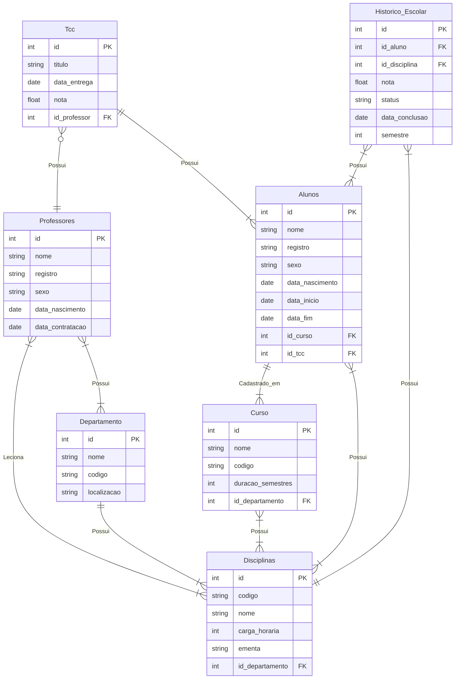

# Tabelas

- Alunos
- Professores
- Disciplinas
- Notas
- Cursos/Departamento (Tabrla cursos com o campo departamento)
- Historico escolar ()

```mermaid
erDiagram
    Alunos ||--|{ Curso : Cadastrado_em
    Curso }|--|{ Disciplinas : Possui
    Disciplinas }|--|{ Alunos : Possui
    Professores }|--|{ Disciplinas : Leciona
    Professores }|--|{ Departamento : Possui

    Departamento ||--|{ Disciplinas: Possui
    Tcc }o--|| Professores: Possui
    Tcc ||--|{ Alunos: Possui
    Historico_Escolar }| -- |{ Alunos : Possui
    Historico_Escolar }| -- || Disciplinas : Possui

    
    
    Alunos {
        int id PK
        string nome
        string registro
        string sexo
        date data_nascimento
        date data_inicio
        date data_fim
        int id_curso FK
        int id_tcc FK
    }
    
    Professores {
        int id PK
        string nome
        string registro
        string sexo
        date data_nascimento
        date data_contratacao
    }
    
    Disciplinas {
        int id PK
        string codigo
        string nome
        int carga_horaria
        string ementa
        int id_departamento FK
    }
    
    Curso {
        int id PK
        string nome
        string codigo
        int duracao_semestres
        int id_departamento FK
    }
    
    Departamento {
        int id PK
        string nome
        string codigo
        string localizacao
    }
    
    Tcc {
        int id PK
        string titulo
        date data_entrega
        float nota
        int id_professor FK
    }
    
    Historico_Escolar {
        int id PK
        int id_aluno FK
        int id_disciplina FK
        float nota
        string status
        date data_conclusao
        int semestre
    }   
```
