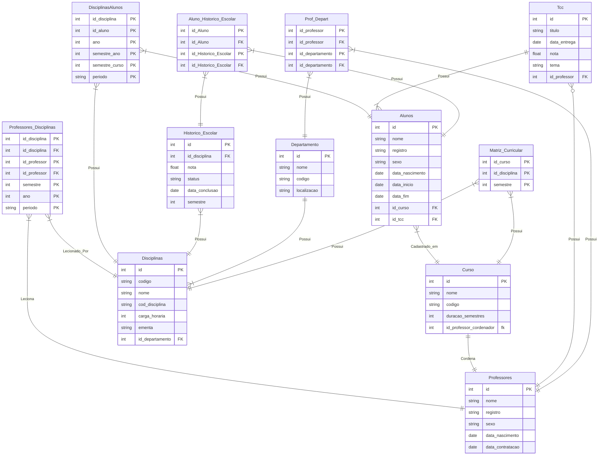

# Tabelas
- Alunos 
- Professores 
- Disciplinas 
- Curso
- Departamento 
- Tcc 
- Historico_Escolar 
- Prof_Depart 
- Professores_Disciplinas
- Matriz_Curricular 
- Aluno_Historico_Escolar
- DisciplinasAlunos 
## Diagrama



# Resumo do projeto

O nosso projeto foi feito inicialmente pelo diagrama de relação de entidade, feito no mermaid do markdown.
Criamos apos as tabelas, e depois fizemos todas as foreign keys, colocando todos no arquivo [montaBanco](montaBanco.sql)
Porem os creates estão no arquivo [CreateTables](CreateTables.sql) de forma separada das querys e das foreign keys
Temos os Selects feito em cima dos dados no arquivo [Querys](Querys.sql)
Ja os dados foram criados a partir do faker no arquivo python [alimentarBanco](alimentarBanco.py)
O Schema é criado a partir do python, que a partir do Sql Alchemy inspeciona o banco de dados criado e gera automaticamente o schema em um arquivo markown [Schema](Schema.md)

# Como Rodar

Fizemos um script completo, que contem na primeira linha a url de conexão do nosso banco para conectar utilizando o dbeaver ou outra IDE de banco de dados, que vai alem de executar a query armazenada no arquivo [Montar Banco](montaBanco), ele vai criar os dados através da biblioteca faker do python, e de alguns exemplos de nomes prédefinidos.
Ele vai criar em ordem de importancia na relação, então ja garante a existencia de relação, mas ainda assim criamos e cuidamos de questões para obrigatoriamente existir certas relações que são descritas no diagrama, por exemplo, todo alunos ter pelo menos 1 historico escolar, ou professor ter pelo menos 1 disciplina.

## Passo a Passo (Windows)
1. Clonar o projeto 
1. Criar um ambiente virtual (recomendado python na versão 3.12.*) ```python -m venv venv```
1. Ativar o ambiente virtual ```venv\Scripts\Activate```
1. Instalar as dependencias utilizadas citadas no documento [requirements](requirements.txt) ```pip install -r requirements.txt```
1. Rodar o python ```python alimentarBanco.py``` (Vale lembrar que o python está com as informações de conexão a banco de dados do nosso projeto, então o será necessário inserir as informações para o seu banco postgres)

# O que o python faz?
O python vai criar o banco utilizando o ddl descrito no arquivo [montaBanco](montaBanco.sql)
Ele inserir os dados e verificar as relações, garantindo que exista relação entre as tabelas de acordo com o diagrama

## Como ele verifica a integridade?
O python vai analisar o schema, montar querys a partir das Fks, e a partir das querys de verificação descritas de todas as relações, ele vai dizer caso funcione ou não


